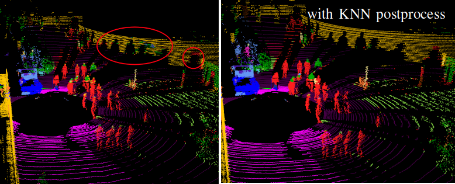

# [RangeNet-TensorRT](https://github.com/Natsu-Akatsuki/RangeNet-TensorRT)

🎉 This project has been a pleasure, allowing me to repay technical debt, learn how to locate bugs during model deployment, gain experience with GitHub Actions, and explore CUDA programming. I greatly appreciate the valuable feedback from others that has contributed to improving the project. I hope that this project will be of use to you.

<div align="center">

[English](README.md) | [简体中文](README_cn.md)

</div>

## 1. Purpose

1. **Use more newer dependencies and APIs**. Specifically, we deploy the [RangeNet repository](https://github.com/PRBonn/rangenet_lib) in an environment with TensorRT 8+, Ubuntu 20.04+, remove Boost dependency, manage TensorRT objects and GPU memory with smart pointers, and provide ROS demo.

2. <b>Faster Performance</b>. Resolve the issue of reduced segmentation accuracy when using FP16 ([issue#9](https://github.com/PRBonn/rangenet_lib/issues/9)), achieving a significant speed boost without sacrificing accuracy. Preprocess data using CUDA. Perform KNN post-processing with libtorch (
   refer to [here](https://github.com/PRBonn/lidar-bonnetal/blob/master/train/tasks/semantic/postproc/KNN.py)).

<p align="center">
	
</p>

## 2. Installation

### 2.1 Docker installation

We provide a Docker installation, please see more in [docker/README.md](docker/README.md)

### 2.2 Source installation

Step 1: Download and Extract libtorch

> [!note]
> Using the Torch library from Conda was observed to slow down the post-processing stage from 6 ms to 30 ms.

```bash
$ wget -c https://download.pytorch.org/libtorch/cu113/libtorch-cxx11-abi-shared-with-deps-1.10.2%2Bcu113.zip -O libtorch.zip
$ unzip libtorch.zip
```

Step 2: Set up the deep learning environment (install NVIDIA driver, CUDA, TensorRT, cuDNN). The tested configurations are listed below. At least <u>3000 MB</u> of GPU memory is required.

| Ubuntu |           GPU           | TensorRT  |      CUDA       |      cuDNN       |         —          |
|:------:|:-----------------------:|:---------:|:---------------:|:----------------:|:------------------:|
| 20.04  |        TITAN RTX        |   8.2.3   | CUDA 11.4.r11.4 |   cuDNN 8.2.4    | :heavy_check_mark: |
| 20.04  |        TITAN RTX        | 10.6.0.26 |   CUDA 11.1.1   |   cuDNN 8.0.5    | :heavy_check_mark: |
| 20.04  | NVIDIA GeForce RTX 3060 |  8.4.1.5  | CUDA 11.3.r11.3 |   cuDNN 8.0.5    | :heavy_check_mark: |
| 20.04  | NVIDIA GeForce RTX 4070 |  10.6.0   | CUDA 11.3.r12.4 | cuDNN 9.1.0.70-1 | :heavy_check_mark: |
| 22.04  | NVIDIA GeForce RTX 3060 |  8.2.5.1  | CUDA 11.3.r11.3 |   cuDNN 8.8.0    | :heavy_check_mark: |
| 22.04  | NVIDIA GeForce RTX 3060 |  8.4.1.5  | CUDA 11.3.r11.3 |   cuDNN 8.8.0    | :heavy_check_mark: |
| 22.04  | NVIDIA GeForce RTX 3060 |  8.4.3.1  | CUDA 11.3.r11.3 |   cuDNN 8.8.0    | :heavy_check_mark: |
| 22.04  | NVIDIA GeForce RTX 3060 |  8.6.1.6  | CUDA 11.3.r11.3 |   cuDNN 8.8.0    | :heavy_check_mark: |
| 22.04  | NVIDIA GeForce RTX 3060 | 10.6.0.26 | CUDA 11.3.r11.3 |   cuDNN 8.8.0    | :heavy_check_mark: |

> [!note]
>
> According to your hardware, you must choose the appropriate version of CUDA

|   GPU Hardware Architecture    |           Relevant GPUs            | Minimum CUDA Version |
|:------------------------------:|:----------------------------------:|:--------------------:|
|    Ampere Architecture（8.6）    | RTX 3060，RTX3070，RTX 3080，RTX 3090 |      CUDA 11.1       |
| Ada Lovelace Architecture（8.9） |         RTX 4090, RTX 4080         |      CUDA 11.8       |

> [!note]
>
> According to your nvidia-driver, you must choose the appropriate version of CUDA

| nvidia-driver Version | Maximum CUDA Version |
|:---------------------:|:--------------------:|
|          545          |      CUDA 12.3       |
|          550          |      CUDA 12.4       |

Add the following environment variables to ~/.bashrc:

```bash
# Example configuration:

# >>> Deep Learning Configuration >>>
# Import CUDA environment
CUDA_PATH=/usr/local/cuda/bin
CUDA_LIB_PATH=/usr/local/cuda/lib64

# Import TensorRT environment
export TENSORRT_DIR=${HOME}/Application/TensorRT-8.4.1.5/
TENSORRT_PATH=${TENSORRT_DIR}/bin
TENSORRT_LIB_PATH=${TENSORRT_DIR}/lib

# Import libtorch environment
export Torch_DIR=${HOME}/Application/libtorch/share/cmake/Torch

export PATH=${PATH}:${CUDA_PATH}:${TENSORRT_PATH}
export LD_LIBRARY_PATH=${LD_LIBRARY_PATH}:${CUDA_LIB_PATH}:${TENSORRT_LIB_PATH}
```

Step 3: (Optional, if ROS components are needed). Please install ROS1 (Noetic) or ROS2 (Humble).

```bash
# Install ROS
$ ...
# Install extra dependency
$ sudo apt install ros-${ROS_DISTRO}-pcl-ros
```

Step 4: Install apt-related and Python packages

```bash
$ sudo apt install build-essential python3-dev python3-pip apt-utils git cmake libboost-all-dev libyaml-cpp-dev libopencv-dev python3-empy libfmt-dev
$ pip install catkin_tools trollius numpy
```

Step 5: Clone the Repository

```bash
$ git clone https://github.com/Natsu-Akatsuki/RangeNet-TensorRT ~/rangenet/src/rangenet/
```

Step 6: Import model files and datasets.

```bash
# Download model files
$ wget -c https://github.com/Natsu-Akatsuki/RangeNet-TensorRT/releases/download/v0.0.0-alpha/model.onnx -O ~/rangenet/src/rangenet/model/model.onnx
```

Download datasets: see [Baidu Cloud](https://pan.baidu.com/s/1iXSWaEfZsfpRps1yvqMOrA?pwd=9394).

<details>
    <summary>Directory Structure</summary>

```bash
.
├── model
│   ├── arch_cfg.yaml
│   ├── data_cfg.yaml
│   └── model.onnx
├── data
└── ├── 000000.pcd
    ├── kitti_2011_09_30_drive_0027_synced
    └── kitti_2011_09_30_drive_0027_synced.bag
    
```

</details>

## 3. Usage

The first run may take some time to generate the TensorRT optimized engine.

<details>
    <summary>:wrench: <b>Usage 1：</b>
        Run data in ROS1 or ROS2
    </summary>

<p align="center"> 
  
</p>

```bash
# >>> ROS1 >>>
$ cd ~/rangetnet/
$ catkin build
$ source devel/setup.bash
$ roslaunch rangenet_pp ros1_rangenet.launch
$ roslaunch rangenet_pp ros1_bag.launch

# >>> ROS2 >>>
$ cd ~/rangetnet/
$ colcon build --symlink-install
$ source install/setup.bash
$ ros2 launch rangenet_pp ros2_rangenet.launch
$ ros2 launch rangenet_pp ros2_bag.launch
```

</details>

<details>
    <summary>:wrench: <b>Usage 2：</b>
        Predict single-frame point clouds (PCD format)
    </summary>

> [!note]
> PCD point cloud fields must be xyzi, and the intensity field should be normalized (0-1).

```bash
# Modify the parameters in config/infer.yaml
$ cd ~/rangenet/src/rangenet/
$ mkdir build
$ cd build

# To display inference time: cmake -DPERFORMANCE_LOG=ON .. && make
$ unset ROS_VERSION && cmake .. && make
$ ./demo
```

|      Step      |    Time    |
|:--------------:|:----------:|
| Preprocessing  | 1.51363 ms |
|   Inference    | 21.8513 ms |
| Postprocessing | 4.98176 ms |

</details>

## 4. FAQ

<details> 
    <summary>:question: <b>Issue 1:</b> 
        [libprotobuf ERROR google/protobuf/text_format.cc:298] Error parsing text-format onnx2trt_onnx.ModelProto: 1:1:
    </summary>

The ONNX model is incomplete. Please Re-download the model.

</details>

<details> 
    <summary>:question: <b>Issue 2:</b> 
        Segmentation fault [Process finished with exit code 139 (interrupted by signal 11:SIGSEGV)] when visualizing single point cloud frames in Ubuntu 22.04 using PCL.
    </summary>

Use PCL library version 1.13.0+. Please provide variable `PCL_DIR` in `cmake/ThirdParty.cmake`. See more in [Here](https://github.com/PointCloudLibrary/pcl/pull/5252).

</details>

## Roadmap

- [x] Test ROS1 demo
- [x] Resolve [issue#8](https://github.com/Natsu-Akatsuki/RangeNetTrt8/issues/8) (2023.07.01)
- [x] Add English documentation (2024.11.19)
- [x] Explain why using FP16 leads to precision degradation [See more in [Here](docs/the_reason_for_why_using__FP16_can_cause_accuracy_degradation.md)] (2024.11.28)
- [x] Provide a Docker environment (2024.11.30)
- [ ] Add Pybind11 implementation
- [ ] Resolve non-reproducibility
- [ ] Refactor code to follow coding standards and improve readability